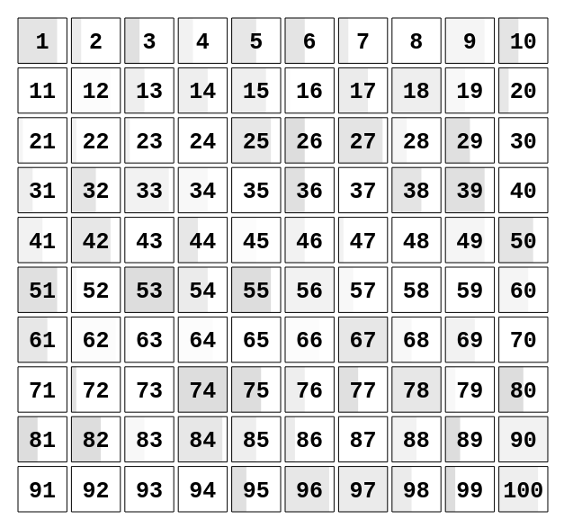

# iconArray

iconArray is an [htmlWidget for R](http://www.htmlwidgets.org) that uses [d3.js](https://d3js.org/) to create icon array visualizations for the web.

## Installation

```r
library(devtools)
install_github("mfontcada/iconArray")
```

## Example

```r
library(iconArray)
iconArray(10, 10,
          bar = sample(seq(0,1,0.1), 100, TRUE),
          border = rep(1, 100),
          color = rep("#DDD", 100),
          opacity = sample(seq(0, 1, 0.1), 100, TRUE),
          labels = seq(1, 100))
```


